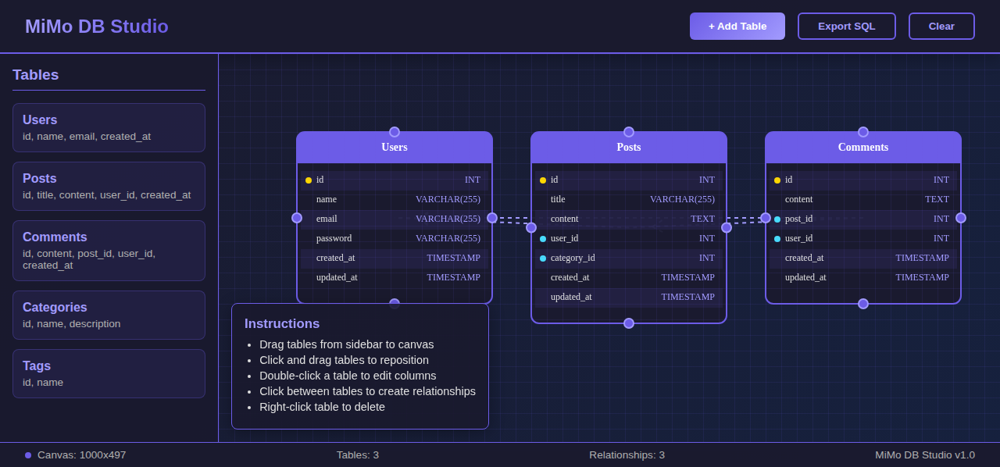

# MiMo DB Studio

A visual database schema designer with canvas-based node graph UI.

## Features

- **Interactive Canvas**: Drag-and-drop tables onto a grid canvas
- **Visual Relationships**: See foreign key connections between tables
- **Purple/Blue Theme**: Modern dark interface with gradient accents
- **Export SQL**: Generate SQL schema from your visual design
- **Drag & Drop**: Reposition tables freely on the canvas

## Tables Included

- **Users**: User accounts with authentication fields
- **Posts**: Blog/content posts with user relationships
- **Comments**: Comments linked to posts and users
- **Categories**: Content categorization
- **Tags**: Tagging system

## Usage

1. Open `index.html` in a web browser
2. Drag tables from the sidebar onto the canvas
3. Reposition tables by clicking and dragging
4. View relationship lines connecting foreign keys
5. Click "Export SQL" to download your schema

## Technical Details

- Pure HTML5 Canvas for rendering
- No external dependencies
- Responsive design
- Keyboard accessible

## Screenshot

---

Built with ❤️ by MiMo Agent